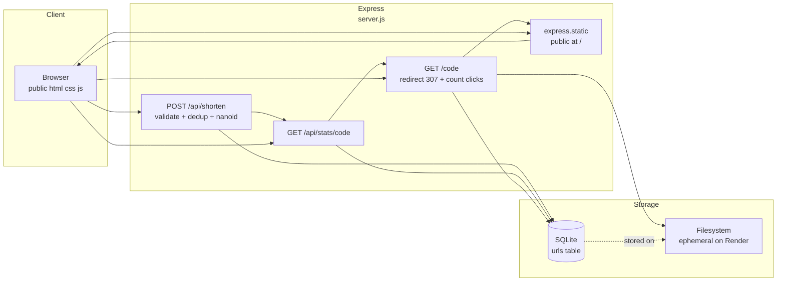

# lnkshrnk - URL Shortener (Node.js)

> Paste a long link, get a short code. Custom aliases, dedup, click counting. Express + SQLite + nanoid, single-file backend.

Try it here (completely self-hosted with Serveo reverse proxy): https://lnkshrnk.serveousercontent.com/

> Node.js port of [lnkshrnk-url-shortner](https://github.com/bhuvan11000/lnkshrnk-url-shortner) (Python/FastAPI).

---

## Overview

`lnkshrnk` is a production-ready URL shortener built for Render’s free tier. No framework on the frontend - plain HTML/CSS/vanilla JS served as static files via Express. No ORM - raw `node:sqlite` (`DatabaseSync`) with a single synchronous connection. Codes are generated with the `nanoid` package (`customAlphabet(alphabet, 6)` with alphabet `A-Za-z0-9_-`) with a 5-attempt collision retry.

Single job: **shorten a URL fast, with an optional human-readable code, and redirect reliably.**

---

## High-Level Architecture



### Request flows

**1. Shorten** `POST /api/shorten {url, custom?}`

```
client fetch → Express validates http(s)://, custom regex ^[A-Za-z0-9_-]{3,20}$, reserved check (api/admin/static/favicon.ico)
            → if custom is None: SELECT code FROM urls WHERE original = ?  (dedup, returns existing short)
            → if custom: INSERT (code,original) → 409 if constraint violation
            → else: loop 5× nanoid(6) → INSERT → 500 if all collide
            → return {short: "https://host/code"}
            → error mapping: 400 bad input, 409 conflict, 500 db error (no stack leak)
```

**2. Redirect** `GET /{code}`

```
GET /Ab3x9 → if "." in code: path.join(public, code).isFile() ? sendFile : 404
           → else SELECT original FROM urls WHERE code=?
           → 404 if missing
           → UPDATE urls SET clicks = clicks+1 WHERE code=?  (best-effort, non-fatal)
           → 307 redirect to original
```

**3. Stats** `GET /api/stats/{code}` → `SELECT code, original, clicks, created_at` → 404 if missing.

**DB handling:** `initDb()` (`server.js:33`) opens a single `DatabaseSync` instance with `PRAGMA journal_mode=WAL`. Table init runs on import. Synchronous API removes need for per-request connections.

---

## Tech Stack

| Layer | Choice | Why |
|---|---|---|
| Backend | Node.js + Express (`server.js:132`) | Single file, minimal, Render-compatible (`$PORT`) |
| DB | SQLite via `node:sqlite` (`server.js:33`) | Zero native deps, experimental but stable on Node 22+, ephemeral is acceptable for free tier |
| IDs | `nanoid` npm (`customAlphabet(alphabet,6)`, `server.js:23`) | Spec-mandated alphabet, not `crypto.randomUUID` |
| Frontend | HTML/CSS/vanilla JS (`public/`) | No build step, served via `express.static` |
| Type | Syne 800 / Inter / JetBrains Mono | Display / body / code |

---

## Project Structure

```
lnkshrnk-url-shortner-node/
├── server.js          # Express app, DB helpers, 3 routes + static mount
├── package.json       # express, nanoid
├── .gitignore         # node_modules/, shortener.db, .env
├── public/
│   ├── index.html     # form (url-input, custom-input, submit), ticket result, copy
│   ├── style.css      # tokens, dotted grid, hard-shadow card, perforated ticket stub
│   └── script.js      # fetch /api/shorten, error handling, clipboard fallback
└── shortener.db       # auto-created at runtime, gitignored
```

### Database schema (`server.js:41`)

```sql
CREATE TABLE IF NOT EXISTS urls (
  code       TEXT PRIMARY KEY,
  original   TEXT NOT NULL,
  clicks     INTEGER DEFAULT 0,
  created_at TEXT DEFAULT CURRENT_TIMESTAMP
);
```

---

## API

### `POST /api/shorten`
Body `{ url: string, custom?: string }`

- Validates `url` starts with `http://` or `https://` → 400
- Validates `custom` matches `^[A-Za-z0-9_-]{3,20}$` and not in `api,admin,static,favicon.ico` (case-insensitive) → 400
- Dedup by `original` lookup → returns existing `short` if no custom
- Custom taken → 409
- Auto code: `nanoid(size=6)` loop 5, catch constraint → 500 on exhaustion

Response `200`: `{ "short": "https://<host>/<code>" }`

```bash
curl -X POST http://127.0.0.1:8000/api/shorten \
  -H "Content-Type: application/json" \
  -d '{"url":"https://example.com/very/long","custom":"my-code"}'
```

### `GET /{code}`
- File fallback if `code` contains `.` → `sendFile(public/…)` else 404
- Else lookup, increment `clicks`, `307` to `original`, else 404

### `GET /api/stats/{code}`
Returns `{ code, original, clicks, created_at }` or 404.

All DB ops wrapped in `try/catch` → JSON `{detail: ...}` with 400/404/409/500, no raw traces.

### Other routes
- `GET /health` and `GET /api/health` → `{status, db, ts}`
- `GET /api/recent?limit=10` → last N mappings, clamped to 50

---

## Frontend

- **Hero:** eyebrow `compression utility` + lead copy, no template hero stats.
- **Card:** `2px` ink border + `6px` hard shadow, dotted hint `ORIGINAL ···· SHORT`.
- **Inputs:** `input-wrap` with prefix `↳` / `/`, `JetBrains Mono` for codes, `field-help` for constraints.
- **Button:** signal `#FF3B1F` with hard shadow, `→` shift on hover.
- **Signature - ticket stub** (`public/style.css:299`): left `#FF3B1F` perforated spine + radial-gradient dots, `ticketIn` animation, mono `#short-link` + ink `Copy` button.
- **Meta grid + footer** for dedup/clicks/length hints. Footer updated from FastAPI to Node.js branding.
- JS (`public/script.js`): `fetch` POST, handles `400/409` via `detail`, `showResult` re-triggers animation, clipboard via `navigator.clipboard` with `execCommand` fallback, live error clear on input.

Only change from Python version is the footer text (`Built with Node.js · Express · SQLite · nanoid`) — behavior is identical.

---

## Getting Started (local)

```bash
npm install
npm start
# or dev with watch: npm run dev
# open http://127.0.0.1:8000
```

Custom port / DB:

```bash
PORT=3000 DB_PATH=./shortener.db node server.js
LOG_LEVEL=debug npm start
```

`shortener.db` is created on import; delete it to reset.

---

## Deployment - Render (free tier)

- Runtime: `Node.js 18+` (tested on 24)
- Build: `npm install`
- Start: `npm start`  or  `node server.js --host 0.0.0.0 --port $PORT` (`server.js:338`)
- Caveats: filesystem ephemeral → SQLite resets on redeploy; service sleeps after ~15 min idle, first request ~30–50s cold start. Persist with Postgres/Redis when needed.

Zero changes needed from repo to Render.

---

## Error Handling

| Case | Status | Message |
|---|---|---|
| `url` without `http(s)://` | 400 | `URL must start with http:// or https://` |
| `custom` bad pattern | 400 | `Custom code must be 3-20 characters…` |
| `custom` reserved | 400 | `'{code}' is a reserved word…` |
| `custom` taken | 409 | `Custom code already taken` |
| `code` not found (redirect/stats) | 404 | `Short code not found` |
| Static file miss (`code` with `.`) | 404 | `Not Found` |
| DB failure / nanoid exhaustion | 500 | `Database error` / `Failed to generate unique code…` |

---

## Porting Notes (Python → Node)

| Concern | Python (`main.py`) | Node (`server.js`) |
|---|---|---|
| Framework | FastAPI + Pydantic | Express + `express.json()` |
| SQLite | `sqlite3` fresh connection per request | `node:sqlite` `DatabaseSync` single instance (sync, no thread issues) |
| IDs | `nanoid` PyPI `generate(size=6)` | `nanoid` npm `customAlphabet(alphabet,6)` same alphabet |
| Validation | Pydantic + helpers | Plain JS helpers (`isValidUrl`, etc.) — same regex & messages |
| Redirect | `RedirectResponse(status_code=307)` | `res.redirect(307, url)` |
| Static | `app.mount("/", StaticFiles(...))` after redirect | `app.use(express.static(...))` after `/:code` + dot-fallback `sendFile` |
| Health | `time.time()` | `Math.floor(Date.now()/1000)` |

Behavior, status codes, and JSON shapes (`{short}`, `{detail}`, stats) are kept identical so the existing frontend works unchanged.

---

## License

MIT - see `LICENSE`.
